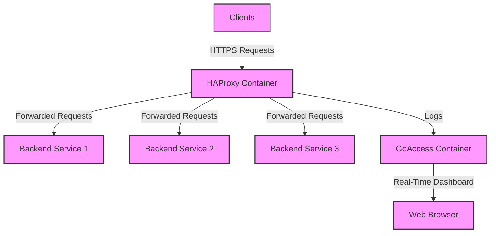

## Introduction
This guide provides a step-by-step approach to setting up edge traffic monitoring and real-time log analysis using GoAccess and HAProxy. By the end of this guide, you will have a functional setup 

<Info>
## Prerequisites
Before we begin, ensure you have the following prerequisites in place:
- A server or virtual machine with Docker installed.
- A domain name pointing to your server's IP address.
- Basic knowledge of Docker and GoAccess.
</Info>
## Overview of the Deployment
In this guide, we will cover the following steps:
1. Setting up HAProxy to handle incoming traffic.   
2. Configuring GoAccess for real-time log analysis.
3. Integrating HAProxy logs with GoAccess for monitoring.
## Logical Diagram

## Step 1: Setting up HAProxy
You can check the HAProxy setup guide [here](P-Container/implementation-of-haproxy-for-ssltls-termination-and-traffic-distribution.mdx) to deploy HAProxy as a reverse proxy for your backend services.
## Step 2: Configuring GoAccess for Real-Time Log Analysis