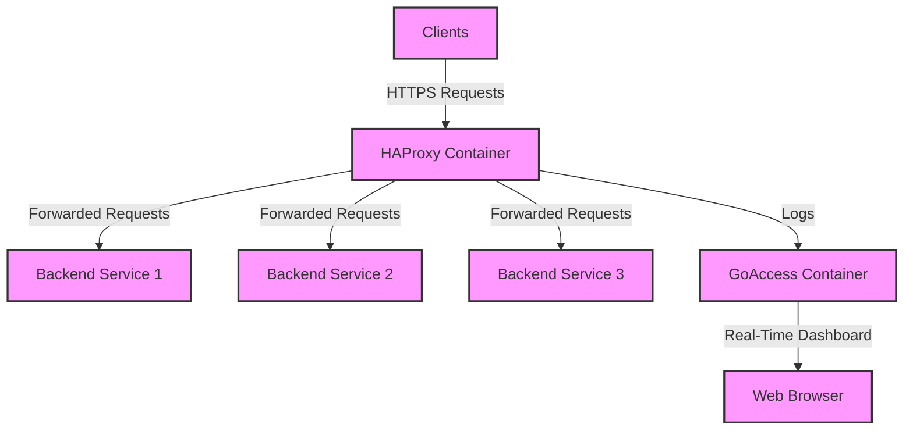

## Introduction
This guide provides a step-by-step approach to setting up edge traffic monitoring and real-time log analysis using GoAccess and HAProxy. By the end of this guide, you will have a functional setup 

<Info>
## Prerequisites
Before we begin, ensure you have the following prerequisites in place:
- A server or virtual machine with Docker installed.
- A domain name pointing to your server's IP address.
- Basic knowledge of Docker and GoAccess.
</Info>
## Overview of the Deployment
In this guide, we will cover the following steps:
1. Setting up HAProxy to handle incoming traffic.   
2. Configuring GoAccess for real-time log analysis.
3. Integrating HAProxy logs with GoAccess for monitoring.
## Logical Diagram

## Step 1: Setting up HAProxy
You can check the HAProxy setup guide [here](implementation-of-haproxy-for-ssltls-termination-and-traffic-distribution.mdx) to deploy HAProxy as a reverse proxy for your backend services.
## Step 2: Configuring GoAccess for Real-Time Log Analysis
a. Create a Docker Compose file named `docker-compose.yml` with the following content:
```yaml
services:
  geoip-updater:
    image: ghcr.io/maxmind/geoipupdate:latest
    environment:
      - GEOIPUPDATE_ACCOUNT_ID=12xxxxx
      - GEOIPUPDATE_LICENSE_KEY=xxxxxxxxxxxxxx
      - GEOIPUPDATE_EDITION_IDS=GeoLite2-City GeoLite2-ASN
      - GEOIPUPDATE_FREQUENCY=72
    volumes:
      - /mnt/nfs-share/goaccess/geoip:/usr/share/GeoIP
    deploy:
      replicas: 1
      restart_policy:
        condition: on-failure

  goaccess-engine:
    image: allinurl/goaccess:latest
    networks:
      - traefik
    environment:
      - TZ=Asia/Dhaka
    volumes:
      - /mnt/nfs-share/goaccess/logs/haproxy:/logs:ro
      - /mnt/nfs-share/goaccess/report:/report
      # --- ADDED THIS LINE BELOW ---
      - /mnt/nfs-share/goaccess/geoip:/geoip:ro
    command: >
      /logs/haproxy.log
      --log-format='%h:%^ [%d:%t.%^] %^ %^ %^/%^/%^/%^/%L %s %b %^ %^ %^ %^/%^/%^/%^/%^ %^/%^ %^ %^ "%r" {%R} {%u}'
      --time-format='%H:%M:%S'
      --date-format='%d/%b/%Y'
      --tz=Asia/Dhaka
      --real-time-html
      --no-global-config
      --output=/report/index.html
      --addr=0.0.0.0
      --port=7890
      --ws-url=wss://stats.riad.com.bd:443/ws
      --geoip-database=/geoip/GeoLite2-City.mmdb
      -d
      --double-decode
      # Hide your own domain so you see real referrers
      --hide-referer=riad.com.bd
      --hide-referer=container.riad.com.bd
      --hide-referer=stats.riad.com.bd
    deploy:
      replicas: 1  # Changed to 1 to avoid NFS write conflicts
      labels:
        - "traefik.enable=true"
        - "traefik.swarm.network=traefik"
        - "traefik.http.routers.stats-ws.rule=Host(`stats.riad.com.bd`) && PathPrefix(`/ws`)"
        - "traefik.http.routers.stats-ws.entrypoints=web"
        - "traefik.http.routers.stats-ws.priority=100"
        - "traefik.http.routers.stats-ws.service=stats-ws"
        - "traefik.http.services.stats-ws.loadbalancer.server.port=7890"

  goaccess-web:
    image: nginx:alpine
    networks:
      - traefik
    volumes:
      - /mnt/nfs-share/goaccess/report:/usr/share/nginx/html:ro
    deploy:
      replicas: 2
      labels:
        - "traefik.enable=true"
        - "traefik.swarm.network=traefik"
        - "traefik.http.routers.stats.rule=Host(`stats.riad.com.bd`)"
        - "traefik.http.routers.stats.entrypoints=web"
        - "traefik.http.routers.stats.priority=1"
        - "traefik.http.routers.stats.service=stats"
        - "traefik.http.services.stats.loadbalancer.server.port=80"

networks:
  traefik:
    external: true
  # --- ADDED THIS TO PREVENT goaccess_default ---
  default:
    external: true
    name: traefik
```

