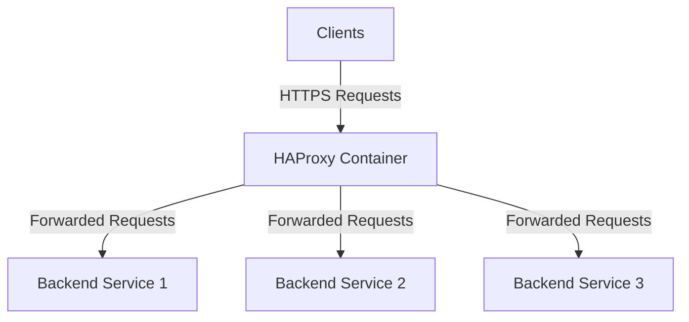

## Introduction
HAProxy is a powerful open-source software that provides high availability, load balancing, and proxying for TCP and HTTP-based applications. It is widely used for SSL/TLS termination and traffic distribution, ensuring secure and efficient handling of client requests. This guide will walk you through the implementation of HAProxy for SSL/TLS termination and traffic distribution.   
<Info>
## Prerequisites
Before we begin, ensure you have the following prerequisites in place:
- A server or virtual machine with Docker installed.
- A domain name pointing to your server's IP address.
- Basic knowledge of Docker and HAProxy.
</Info>
## Overview of the Deployment   
The deployment consists of the following components:
- **HAProxy Container**: Responsible for SSL/TLS termination and load balancing incoming traffic.   
- **Backend Services**: The application servers that will handle the actual requests after HAProxy terminates the SSL/TLS connection.
- **SSL/TLS Certificates**: Used to secure the communication between clients and HAProxy.
## Benefits of Using HAProxy for SSL/TLS Termination
- **Improved Security**: HAProxy handles SSL/TLS encryption, ensuring secure communication between clients and the server.
- **Load Balancing**: Distributes incoming traffic across multiple backend servers, improving performance and
    reliability.
- **Scalability**: Easily add or remove backend servers without affecting the client experience.
- **Centralized Management**: Simplifies SSL/TLS certificate management by handling it at the HAProxy level.
- **Performance Optimization**: Offloads SSL/TLS processing from backend servers, allowing them to focus on application logic.
- **Docker swarm compatibility**: Easily deploy and manage HAProxy in a Docker swarm environment for high availability.
- **Resource Efficiency**: Reduces the load on backend servers by managing SSL/TLS connections centrally.
- **Advanced Security Policies**: Implement security policies such as rate limiting, IP whitelisting, and DDoS protection at the HAProxy level.
- ** High Availability for docker swarm**: Ensure continuous service availability by deploying HAProxy in a Docker swarm with multiple replicas.     
## Diagram

## Step-by-Step Implementation
### Step 1: Set Up HAProxy Configuration File
a. Create a file named `haproxy.cfg` in the `/opt/haproxy/` directory with the following content:
```plaintext
global
    log stdout format raw local0 ## Log to stdout in raw format using local0 facility
    daemon
    maxconn 50000 ## Maximum concurrent connections


defaults
    mode http ## Operate in HTTP mode
    log global ## Use global logging settings
    timeout connect 10s ## Timeout for connection to server
    timeout client 30s ## Timeout for client connections
    timeout server 30s ## Timeout for server connections
    timeout tunnel 1h ## Timeout for tunnel connections (e.g., WebSockets)

frontend fe_main ## Frontend for HTTP traffic
    bind *:80 ## Listen on port 80 for HTTP traffic
    bind *:443 ssl crt /opt/palonet/haproxy/certs/palonet.org.pem alpn h2,http/1.1 ## Listen on port 443 for HTTPS traffic with SSL certificate
    
    # 1. Capture the SSL handshake error if it exists
    tune.ssl.capture-buffer-size 128

    # 2. Redirect only if it's actually port 80 or not SSL
    http-request redirect scheme https code 301 unless { ssl_fc }

    # 3. Add SSL info to your log-format to see the TLS version/Cipher
    log-format "%t %ci:%cp [%TR] %ft %b/%s %ST %B \"%r\" SSL_ver:%sslv SSL_cipher:%sslc"
    http-request set-header X-Forwarded-Proto https
    http-request set-header X-Forwarded-Port 443

    default_backend be_traefik_swarm

backend be_traefik_swarm
    balance roundrobin
    # Recommended for modern microservices
    option http-keep-alive 
    default-server inter 2s fall 3 rise 2 send-proxy-v2
    # Ensure Host header is preserved for Traefik routing
    http-request set-header Host %[hdr(host)] 

    # Improved WebSocket Support
    # This checks for the existence of the header more reliably
    http-request set-header Upgrade %[hdr(Upgrade)]
    http-request set-header Connection "upgrade" if { hdr(Upgrade) -i WebSocket }

    # Health check
    option httpchk GET /ping
    http-check expect status 200

    server manager1 192.168.xx.xx:80 check
    server manager2 192.168.xx.xx:80 check
    server manager3 192.168.xx.xx:80 check

listen stats_prometheus
    bind *:8404
    mode http
    stats enable
    stats uri /metrics ## Metrics endpoint
    http-request use-service prometheus-exporter ## Enable Prometheus exporter
    stats auth admin:##########
```