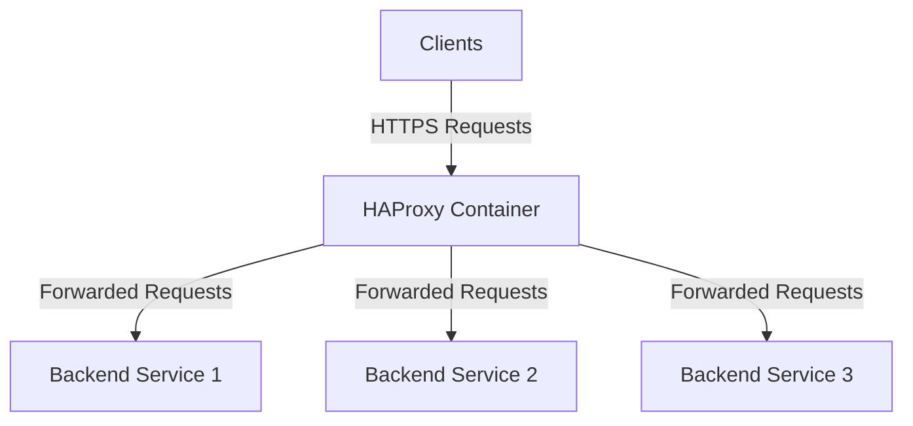

## Introduction
HAProxy is a powerful open-source software that provides high availability, load balancing, and proxying for TCP and HTTP-based applications. It is widely used for SSL/TLS termination and traffic distribution, ensuring secure and efficient handling of client requests. This guide will walk you through the implementation of HAProxy for SSL/TLS termination and traffic distribution.   
<Info>
## Prerequisites
Before we begin, ensure you have the following prerequisites in place:
- A server or virtual machine with Docker installed.
- A domain name pointing to your server's IP address.
- Basic knowledge of Docker and HAProxy.
</Info>
## Overview of the Deployment   
The deployment consists of the following components:
- **HAProxy Container**: Responsible for SSL/TLS termination and load balancing incoming traffic.   
- **Backend Services**: The application servers that will handle the actual requests after HAProxy terminates the SSL/TLS connection.
- **SSL/TLS Certificates**: Used to secure the communication between clients and HAProxy.
## Benefits of Using HAProxy for SSL/TLS Termination
- **Improved Security**: HAProxy handles SSL/TLS encryption, ensuring secure communication between clients and the server.
- **Load Balancing**: Distributes incoming traffic across multiple backend servers, improving performance and
    reliability.
- **Scalability**: Easily add or remove backend servers without affecting the client experience.
- **Centralized Management**: Simplifies SSL/TLS certificate management by handling it at the HAProxy level.
- **Performance Optimization**: Offloads SSL/TLS processing from backend servers, allowing them to focus on application logic.
- **Docker swarm compatibility**: Easily deploy and manage HAProxy in a Docker swarm environment for high availability.
- **Resource Efficiency**: Reduces the load on backend servers by managing SSL/TLS connections centrally.
- **Advanced Security Policies**: Implement security policies such as rate limiting, IP whitelisting, and DDoS protection at the HAProxy level.
- ** High Availability for docker swarm**: Ensure continuous service availability by deploying HAProxy in a Docker swarm with multiple replicas.     
## Diagram

## Step-by-Step Implementation
### Step 1: Set Up HAProxy Configuration File
a. Create a file named `haproxy.cfg` in the `/opt/haproxy/` directory with the following content:
```plaintext
global
    log stdout format raw local0 ## Log to stdout in raw format using local0 facility
    daemon
    maxconn 50000 ## Maximum concurrent connections


defaults
    mode http ## Operate in HTTP mode
    log global ## Use global logging settings
    timeout connect 10s ## Timeout for connection to server
    timeout client 30s ## Timeout for client connections
    timeout server 30s ## Timeout for server connections
    timeout tunnel 1h ## Timeout for tunnel connections (e.g., WebSockets)

frontend fe_main ## Frontend for HTTP traffic
    bind *:80 ## Listen on port 80 for HTTP traffic
    bind *:443 ssl crt /opt/palonet/haproxy/certs/riad.com.bd.pem alpn h2,http/1.1 ## Listen on port 443 for HTTPS traffic with SSL certificate
    
    # 1. Capture the SSL handshake error if it exists
    tune.ssl.capture-buffer-size 128

    # 2. Redirect only if it's actually port 80 or not SSL
    http-request redirect scheme https code 301 unless { ssl_fc }

    # 3. Add SSL info to your log-format to see the TLS version/Cipher
    log-format "%t %ci:%cp [%TR] %ft %b/%s %ST %B \"%r\" SSL_ver:%sslv SSL_cipher:%sslc"
    http-request set-header X-Forwarded-Proto https
    http-request set-header X-Forwarded-Port 443

    default_backend be_traefik_swarm

backend be_traefik_swarm
    balance roundrobin
    # Recommended for modern microservices
    option http-keep-alive 
    default-server inter 2s fall 3 rise 2 send-proxy-v2
    # Ensure Host header is preserved for Traefik routing
    http-request set-header Host %[hdr(host)] 

    # Improved WebSocket Support
    # This checks for the existence of the header more reliably
    http-request set-header Upgrade %[hdr(Upgrade)]
    http-request set-header Connection "upgrade" if { hdr(Upgrade) -i WebSocket }

    # Health check
    option httpchk GET /ping
    http-check expect status 200

    server manager1 192.168.xx.xx:80 check
    server manager2 192.168.xx.xx:80 check
    server manager3 192.168.xx.xx:80 check

listen stats_prometheus
    bind *:8404
    mode http
    stats enable
    stats uri /metrics ## Metrics endpoint
    http-request use-service prometheus-exporter ## Enable Prometheus exporter
    stats auth admin:##########
```
### Step 2: Create Docker Compose File
Create a `docker-compose.yml` file in the `/opt/haproxy/` directory with the following content:
```yaml
services:
  haproxy:
    image: haproxy:lts 
    container_name: haproxy-production
    restart: always
    network_mode: host # Use host networking for direct access to host ports
    user: root ## Run as root to allow binding to low-numbered ports
    # THE FIX: Use a shell to run haproxy and pipe output to the NFS log file
    command: /bin/sh -c "haproxy -f /usr/local/etc/haproxy/haproxy.cfg | tee -a /var/log/haproxy/haproxy.log"
    volumes:
      - /opt/palonet/haproxy/config/haproxy.cfg:/usr/local/etc/haproxy/haproxy.cfg:ro
      - /opt/palonet/haproxy/certs:/opt/palonet/haproxy/certs:ro
      - /opt/palonet/haproxy/errors:/opt/palonet/haproxy/errors:ro
      - /mnt/nfs-share/goaccess/logs/haproxy:/var/log/haproxy
    logging:
      driver: "json-file" ## Use JSON-formatted logging
      options:
        max-size: "50m" ## Maximum size of each log file
        max-file: "3" ## Maximum number of log files to retain
```
## Step 3: Deploy HAProxy Container
Navigate to the `/opt/haproxy/` directory and run the following command to deploy the HAProxy container:
```bash
cd /opt/haproxy/
docker-compose -f docker-compose.yml up -d
```
## Troubleshooting
- **Check HAProxy Logs**: If you encounter issues, check the HAProxy logs located at `/var/log/haproxy/haproxy.log`.
- **Verify Backend Health**: Ensure that the backend services are healthy and accessible by HAProxy.
- **SSL/TLS Issues**: Verify that the SSL/TLS certificates are correctly configured and valid.
- **Network Configuration**: Ensure that the necessary ports (80 and 443) are open and accessible.  
## Conclusion
By following the steps outlined in this guide, you have successfully implemented HAProxy for SSL/TLS    
termination and traffic distribution. This setup enhances the security, performance, and scalability of your applications by efficiently managing incoming traffic and offloading SSL/TLS processing from backend servers. For further customization and optimization, refer to the [official HAProxy documentation](https://www.haproxy.org/documentation/).   
## Additional Resources
- [HAProxy Official Website](https://www.haproxy.org/)
- [HAProxy Documentation](https://www.haproxy.org/documentation/)
- [Docker Official Website](https://www.docker.com/)
- [Docker Documentation](https://docs.docker.com/)
- [Docker Swarm Official Website](https://docs.docker.com/engine/swarm/)
- [Docker Swarm Documentation](https://docs.docker.com/engine/swarm/)
---
## FAQ
### Q1: Can HAProxy handle both HTTP and HTTPS traffic simultaneously?
```plaintext
Yes, HAProxy can be configured to handle both HTTP and HTTPS traffic simultaneously by binding to different ports (e.g., port 80 for HTTP and port 443 for HTTPS) in the frontend configuration.
```
### Q2: How do I update SSL/TLS certificates in HAProxy?
```plaintext
To update SSL/TLS certificates in HAProxy, you need to replace the existing certificate files in the specified directory (e.g., /opt/palonet/haproxy/certs/) and then reload or restart the HAProxy service to apply the changes.
```     
### Q3: What load balancing algorithms does HAProxy support?
```plaintext
HAProxy supports various load balancing algorithms, including round-robin, least connections, source IP hash, and more. You can specify the desired algorithm in the backend configuration using the 'balance' directive.
``` 
### Q4: How can I monitor HAProxy performance?
```plaintext
You can monitor HAProxy performance using the built-in statistics page, which can be enabled in the configuration file. Additionally, you can integrate HAProxy with monitoring tools like Prometheus and Grafana for more advanced metrics and visualization.
``` 
### Q5: Is it possible to use HAProxy in a Docker Swarm environment?
```plaintext    
Yes, HAProxy can be deployed in a Docker Swarm environment. You can create a Docker service for HAProxy and configure it to run in swarm mode, allowing for high availability and scalability.
``` 
### Q6: How do I handle WebSocket connections with HAProxy?
```plaintext    
To handle WebSocket connections with HAProxy, you need to ensure that the appropriate headers (Upgrade and Connection) are set in the frontend configuration. This allows HAProxy to properly manage WebSocket connections and forward them to the backend services.
``` 
### Q7: Can HAProxy perform health checks on backend services?
```plaintext    
HAProxy can perform health checks on backend    
services using the 'option httpchk' directive in the backend configuration. You can specify the health check method and expected response to ensure that only healthy backend servers receive traffic.
```
### Q8: What are some best practices for securing HAProxy?
```plaintext
Some best practices for securing HAProxy include:
- Regularly updating HAProxy to the latest version to benefit from security patches.
- Using strong SSL/TLS configurations and ciphers.
- Implementing access controls and rate limiting to protect against DDoS attacks.
- Monitoring logs for suspicious activity.
```
### Q9: How can I optimize HAProxy performance?
```plaintext
To optimize HAProxy performance, consider the following:
- Tuning timeout settings based on your application's needs.
- Enabling keep-alive connections to reduce latency.    
- Using appropriate load balancing algorithms for your traffic patterns.
- Monitoring resource usage and scaling HAProxy instances as needed.
```
### Q10: Can HAProxy be used for TCP traffic as well?
```plaintext
Yes, HAProxy can be configured to handle TCP traffic in addition to HTTP/HTTPS. You can set up TCP frontends and backends in the configuration file to manage TCP connections effectively.
``` 
