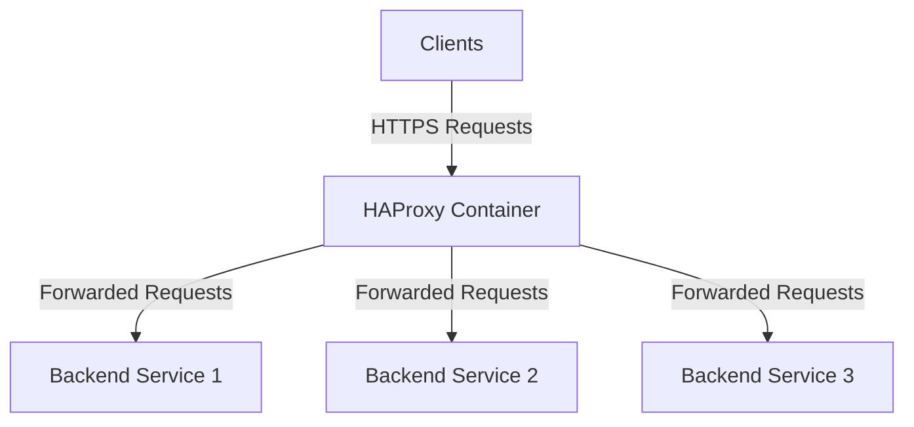

## Introduction
HAProxy is a powerful open-source software that provides high availability, load balancing, and proxying for TCP and HTTP-based applications. It is widely used for SSL/TLS termination and traffic distribution, ensuring secure and efficient handling of client requests. This guide will walk you through the implementation of HAProxy for SSL/TLS termination and traffic distribution.   
<Info>
## Prerequisites
Before we begin, ensure you have the following prerequisites in place:
- A server or virtual machine with Docker installed.
- A domain name pointing to your server's IP address.
- Basic knowledge of Docker and HAProxy.
</Info>
## Overview of the Deployment   
The deployment consists of the following components:
- **HAProxy Container**: Responsible for SSL/TLS termination and load balancing incoming traffic.   
- **Backend Services**: The application servers that will handle the actual requests after HAProxy terminates the SSL/TLS connection.
- **SSL/TLS Certificates**: Used to secure the communication between clients and HAProxy.
## Diagram

## Step-by-Step Implementation
### Step 1: Set Up HAProxy Configuration File
a. Create a file named `haproxy.cfg` in the `/opt/haproxy/` directory with the following content:
```plaintext
# =====================
# Global Settings
# =====================
global
    # Log to stdout in raw format using local0 facility
    log stdout format raw local0
    # Run as a daemon in background
    daemon
    # Maximum concurrent connections
    maxconn